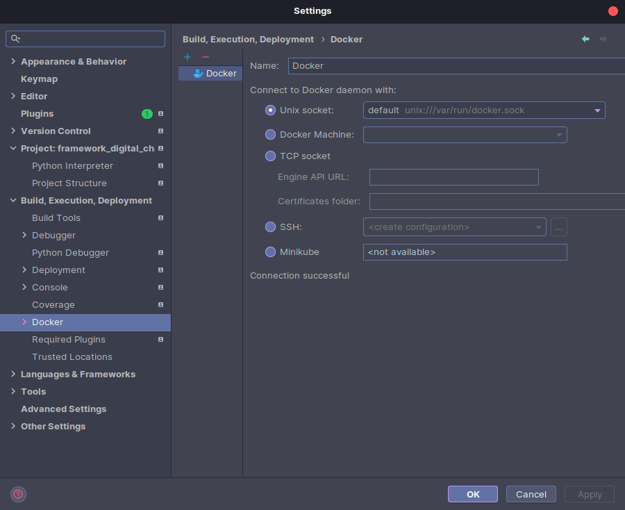
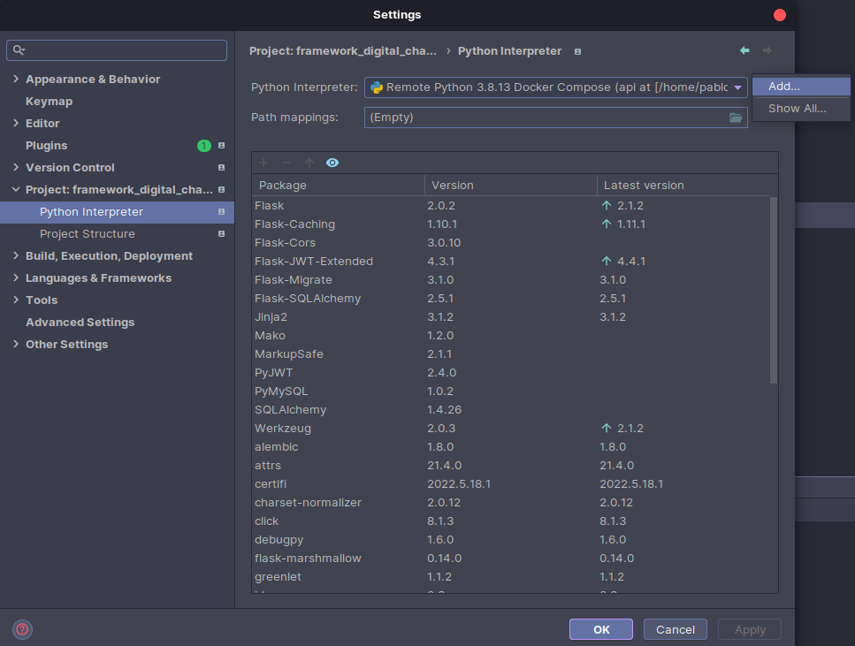
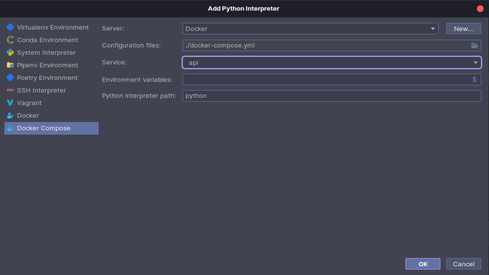
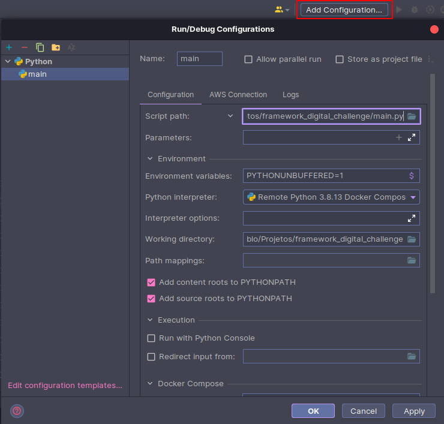
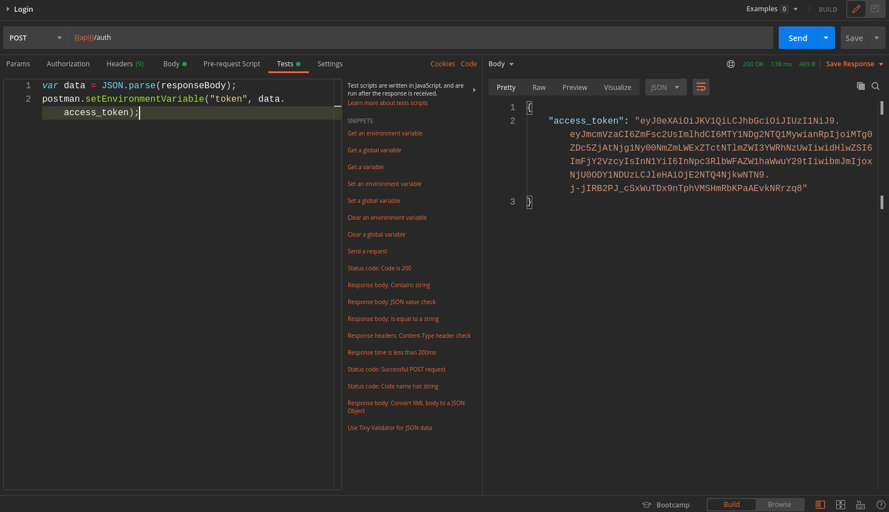
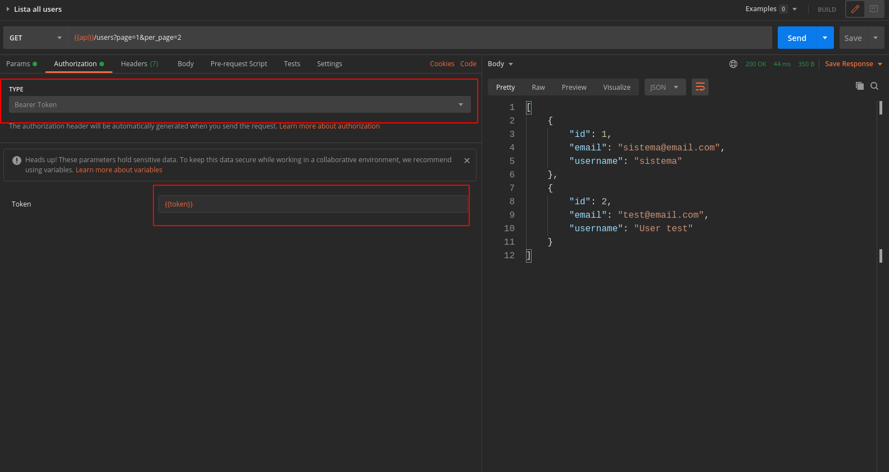

# Framework Digital Challenge

Api rest do desafio da framework digital.

#### 1. Primeiro, instale o docker
* [Docker](https://docs.docker.com/engine/install/debian/)

* Se você utiliza linux, simplesmente execute
```
curl -fsSL https://get.docker.com -o get-docker.sh
sh get-docker.sh

sudo curl -L "https://github.com/docker/compose/releases/download/1.29.1/docker-compose-$(uname -s)-$(uname -m)" -o /usr/local/bin/docker-compose
sudo chmod +x /usr/local/bin/docker-compose

sudo usermod -aG docker $USER
```
* Após isso, reinicie seu computado.
* Senão, siga o tutorial referente ao seu sistema operacional: [Página de instalação do docker](https://docs.docker.com/engine/install/)

#### 2. Clone o projeto

```
git clone git@github.com:pcarvalho-dev/framework_digital_challenge.git
cd framework_digital_challenge
```

#### 3. Inicie o projeto
* Novamente, se seu sistema for o linux, use o seguinte script para rodar o BackEnd

```console
bash init.sh
```
* Ou então use o seguinte comando no seu sistema Windows, Linux ou Mac
```console
docker-compose up --build
```

#### 4. Para configurar sua IDE: Pycharm
>É possível executar seu contêiner e depurar com ele usando PyCharm.

* Build, Execution, Deployment
>Para habilitar o docker no PyCharm: File>Settings > Build, Execution, Deployment > Docker
> 

>Clique em no icone **+** e use a configuração padrão

* Project Interpreter
>Precisamos criar um interpretador python com docker-compose.
>
>Vá em File > Settings > Project: framework_digital_challenge > Python Interpreter
>
>Adcione a configuração clicando em 

 e configure assim: 


* Run/Debug Configurations
>A etapa final da configuração é definir a configuração Executar/Depurar, **crie uma configuração utilizando Remote Interpreter**. 


>Assim que o projeto estiver instalado e funcionando, basta depurar o aplicativo clicando no ícone de depuração 
>
>>Tudo pronto

#### Para restaurar novamente sua base de dados
```
docker-compose down -v && docker-compose up -d
```


# Testes Unitários - Pytest
* Para executar os testes localmente, é necessário que a aplicação do backend esteja rodando. 

#### Para executar os testes localmente
```
docker-compose exec api pytest tests -v 
```

# Postman Collection
* A coleção de requisições do Postman se encontra no seguinte local:
static/documentation/postman 

#### Para que o postman detecte o access token automaticamente nas requisições verifique se na aba "Tests" da requisição de auth no postman possui o seguinte script:
```
var data = JSON.parse(responseBody);
postman.setEnvironmentVariable("token", data.access_token); 
```



#### Caso prefira, passe o access token retornado pela rota auth manualmente na aba Authorization ou na aba Headers





